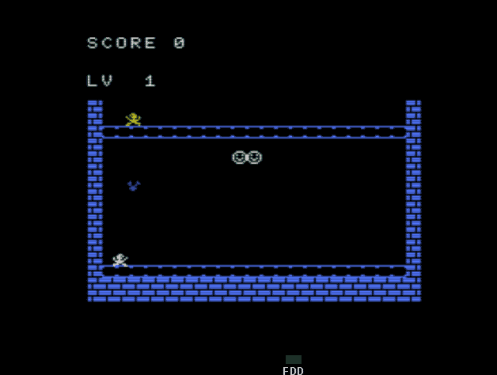

# Freefall

By MSX Murcia "MSX.tipolisto.es"

## Play online

https://kikemadrigal.github.io/freefall/?disk=freefall.dsk

## English

### Introduction

Game born from the tests of the MSX Murcia programmers.

The objective of the game is to reach the maximum level and catch as many smiley faces

Cursors to move the player and space key to jump

### Code

1 'Initialization'
1 'We define the video mode 256x192 pixels, 8x8 sprites and we remove the sound from the keys'
1 'We dump the sprites in VRAM, routine 110: player from 0 to 3 (plane 0) and 4 the flowerpot (plane 1), the enemy is plane 2
1 'We paint the stage'
1 'We paint in the upper left part the current level
1 'Game variables
1 'X e Y=player coordinates
1 'Q1 to Q4 and SR=sprites player
1 'NI=level
1 'CO=color of the stage tiles
1 'H, J=x and y coordinate flowerpot
1 'D=VRAM address where sprites are defined
1 'PU=score'
1 'SA=active jump'
1 'Y1=starting position axis y player
1 'V=jump speed'
10 SCREEN1,0,0:RESTORE:GOSUB110:FORR=5TO20:LOCATE,R:PRINT"b":LOCATE22,R:PRINT"b":NEXT:FORR=1TO21:LOCATER,19:PRINT"b":LOCATER,20:PRINT"b":LOCATER,18:PRINT"a":LOCATER,7:PRINT"a":NEXT:X=30:Y=136:Q1=1:Q2=3:Q3=0:Q4=2:J=60:N=2:SR=Q1:CO=0:LOCATE,3:PRINT"LV  1"

1 'Main loop'
1 'M=key pressed'
1 'If a cursor key is pressed we move the player according to the pressed key
1 'If player is jumping we update it with routine 105
1 'We paint the player'
1 'for the animation we will exchange the sprites with swap Q1 to Q4 variables'
15 M=STICK(0):ONSAGOSUB105:PUTSPRITE0,(X,Y),15,SR:IFM=3THENSR=Q1:X=X+3:ONSAGOTO20:SWAPQ1,Q2:GOTO20:ELSEIFM=7THENSR=Q3:X=X-3:ONSAGOTO20:SWAPQ3,Q4
1 'We check if there is a collision with the smiley faces, which is tile 98 '
1 'We update the flowerpot to down'
20 D=BASE(5)+((Y/8)+1)*32+(X/8):IFM=3ANDVPEEK(D)=98THENX=X-3:GOTO21:ELSEIFM=7ANDVPEEK(D)=98THENX=X+3:GOTO21
1 'We paint the smiley faces erasing the previous position and generating a new random one on the x axis'
21 IFSA=1THENIFVPEEK(D)=1THENSOUND1,0:SOUND7,56:SOUND12,50:SOUND13,0:LOCATEF,9:PRINT"  ":PU=PU+10:LOCATE5,0:PRINT PU:F=RND(1)*18+3:LOCATEF,9:PRINT"AA"
1 'We paint and update the flowerpot
1 'We paint and update the enemy'
50 PUTSPRITE1,(H,J),4,4:J=J+N:IFJ>136THENSOUND8,16:SOUND7,55:SOUND12,15:SOUND13,0:FORR=1TO2:PUTSPRITER,(1,209):NEXT:J=60:H=RND(1)*160+20:PUTSPRITE2,(H,47),10,0:CO=CO+1:IFCO>4THENN=N+1:LOCATE3,3:PRINTN-1:CO=0:COLOR=(5,3,RND(1)*7,5):GOTO15ELSEGOTO15ELSE15
1 'End of main loop '

1 'Flowerpot collision routine:
1 'Death sound effect '
1 'We paint with a nice game over effect'
1 'We start again'
80 SPRITEOFF:FORR=15TO0STEP-2:SOUND8,R:FORT=0TO200STEP5:SOUND0,T:SOUND6,1:SOUND7,50:SOUND13,0:NEXT:NEXT:DEFUSR=&H90:SN=USR(0):FORR=0TO4:PUTSPRITER,(1,209):NEXT:SCREEN1:LOCATE10,10:PRINT"GAME OVER":FORR=0TO500:COLORRND(1)*15,1,1:NEXT:GOTO10
1 'Jump update'
90 SA=1:Y1=Y:V=8:STRIG(0)OFF:SOUND8,16:SOUND1,1:SOUND7,56:SOUND12,10:SOUND13,0:RETURN
1 'Jump routine'
105 Y=Y-V:IFY<Y1-70THENV=-V:RETURNELSEIFY>Y1THENY=136:SA=0:STRIG(0)ON:V=-V:RETURNELSERETURN
1 'Sprite loading routine in VRAM'
110 COLOR15,1,1:DEFINTA-Z:H=RND(1)*160+20:FORI=0TO39:READS:VPOKE&H3800+I,S:NEXT:GOSUB130:F=10:LOCATEF,9:PRINT"AA":RETURN:DATA24,44,157,73,62,28,103,193,24,52,185,146,124,56,230,131,24,44,157,73,62,12,12,24,24,52,185,146,124,48,48,24,,,34,99,36,24,60,24
1 'When space is pressed we will go to the jump routine of line 90'
130 ONSTRIGGOSUB90:STRIG(0)ON:ONSPRITEGOSUB80:SPRITEON:SA=0:KEYOFF:HC=0:PU=0:LOCATE0,0:PRINT"SCORE";PU:PUTSPRITE2,(H,47),10,1:FORC=97TO98:FORI=0TO7:READA:VPOKEC*8+I,A:NEXT:NEXT:VPOKE8204,1*16+5:RETURN:DATA,126,255,255,255,255,126,,4,4,4,255,32,32,32,255

## Spanish

### Introducción

Juego nacido de las pruebas de los programadores de MSX Murcia.

El objetivo del juego es llegar al máximo nivel y coger la mayor candtidad de caritas sonrientes

Cursores para mover al jugador y tecla espacio para saltar

### código

1 'Inicializacion'
1 'Definimos el modo de video 256x192 pixeles, sprites de 8x8 y le quitamos el sonido a las teclas'
1 'Volcamos los sprites en VRAM, rutina 110:personaje del 0 al 3 (plano 0) y el 4 la maceta(plano 1), el enemigo es el plano 2
1 'Pintamos el escenario'
1 'Pintamos en la parte de arriba izquierda el nivel actual'
1 'Variables del juego 
1 'X e Y=coordenadas del player
1 'del q1 al q4 y sr=sprite player
1 'NI=nivel
1 'CO=color de los tiles del escenario
1 'H, J=coordenada x e y maceta'
1 'D=dirección VRAM donde están definidos los sprites'
1 'PU=puntuación'
1 'SA=salto activo'
1 'Y1=posicion inicial eje y salto player
1 'V=velocidad salto'
10 SCREEN1,0,0:RESTORE:GOSUB110:FORR=5TO20:LOCATE,R:PRINT"b":LOCATE22,R:PRINT"b":NEXT:FORR=1TO21:LOCATER,19:PRINT"b":LOCATER,20:PRINT"b":LOCATER,18:PRINT"a":LOCATER,7:PRINT"a":NEXT:X=30:Y=136:Q1=1:Q2=3:Q3=0:Q4=2:J=60:N=2:SR=Q1:CO=0:LOCATE,3:PRINT"LV  1"

1 'Blucle principal'
1 'M=tecla pulsada'
1 'Si se pulsa una tecla del cursor movemos al personaje según la tecla pulsada
1 'Si se está saltando lo actualizamos con la rutina 105'
1 'Pintamos al personaje'
1 'para la animación intercambiaremos los sprites con swap Q1 al Q4'
15 M=STICK(0):ONSAGOSUB105:PUTSPRITE0,(X,Y),15,SR:IFM=3THENSR=Q1:X=X+3:ONSAGOTO20:SWAPQ1,Q2:GOTO20:ELSEIFM=7THENSR=Q3:X=X-3:ONSAGOTO20:SWAPQ3,Q4
1 'Comprobamos si hay una colisión con las caritas sonrientes que es el tile 98 '
1 'Actualizamos la maceta para que baje'
20 D=BASE(5)+((Y/8)+1)*32+(X/8):IFM=3ANDVPEEK(D)=98THENX=X-3:GOTO21:ELSEIFM=7ANDVPEEK(D)=98THENX=X+3:GOTO21
1 'Pintamos las caritas sonrientes borrando la posición anterior y generando una nueva aletarioa en el eje x'
21 IFSA=1THENIFVPEEK(D)=1THENSOUND1,0:SOUND7,56:SOUND12,50:SOUND13,0:LOCATEF,9:PRINT"  ":PU=PU+10:LOCATE5,0:PRINT PU:F=RND(1)*18+3:LOCATEF,9:PRINT"AA"
1 'Pintamos y actualizamos la maceta'
1 'Pintamos y actualizamos el enemigo de arriba'
50 PUTSPRITE1,(H,J),4,4:J=J+N:IFJ>136THENSOUND8,16:SOUND7,55:SOUND12,15:SOUND13,0:FORR=1TO2:PUTSPRITER,(1,209):NEXT:J=60:H=RND(1)*160+20:PUTSPRITE2,(H,47),10,0:CO=CO+1:IFCO>4THENN=N+1:LOCATE3,3:PRINTN-1:CO=0:COLOR=(5,3,RND(1)*7,5):GOTO15ELSEGOTO15ELSE15
1 'Fin del blucle principal'

1 'Rutina colisión con maceta'
1 'Efecto de sonido de muerte'
1 'Pintamos con un efecto bonito game over'
1 'Volvemos a empezar'
80 SPRITEOFF:FORR=15TO0STEP-2:SOUND8,R:FORT=0TO200STEP5:SOUND0,T:SOUND6,1:SOUND7,50:SOUND13,0:NEXT:NEXT:DEFUSR=&H90:SN=USR(0):FORR=0TO4:PUTSPRITER,(1,209):NEXT:SCREEN1:LOCATE10,10:PRINT"GAME OVER":FORR=0TO500:COLORRND(1)*15,1,1:NEXT:GOTO10
1 'Actualización de salto'
90 SA=1:Y1=Y:V=8:STRIG(0)OFF:SOUND8,16:SOUND1,1:SOUND7,56:SOUND12,10:SOUND13,0:RETURN
1 'Rutina de salto'
105 Y=Y-V:IFY<Y1-70THENV=-V:RETURNELSEIFY>Y1THENY=136:SA=0:STRIG(0)ON:V=-V:RETURNELSERETURN
1 'Rutina de carga de sprites en VRAM'
110 COLOR15,1,1:DEFINTA-Z:H=RND(1)*160+20:FORI=0TO39:READS:VPOKE&H3800+I,S:NEXT:GOSUB130:F=10:LOCATEF,9:PRINT"AA":RETURN:DATA24,44,157,73,62,28,103,193,24,52,185,146,124,56,230,131,24,44,157,73,62,12,12,24,24,52,185,146,124,48,48,24,,,34,99,36,24,60,24
1 'Cuando se pulse el espacio iremos a la rutina de salto de la línea 90'
130 ONSTRIGGOSUB90:STRIG(0)ON:ONSPRITEGOSUB80:SPRITEON:SA=0:KEYOFF:HC=0:PU=0:LOCATE0,0:PRINT"SCORE";PU:PUTSPRITE2,(H,47),10,1:FORC=97TO98:FORI=0TO7:READA:VPOKEC*8+I,A:NEXT:NEXT:VPOKE8204,1*16+5:RETURN:DATA,126,255,255,255,255,126,,4,4,4,255,32,32,32,255
